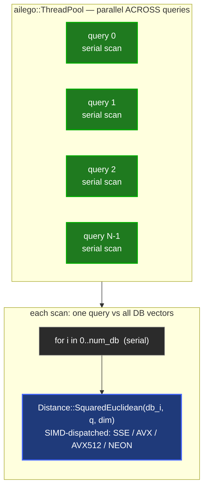
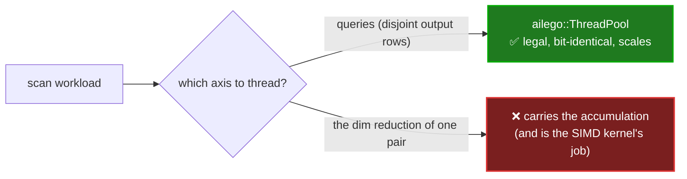
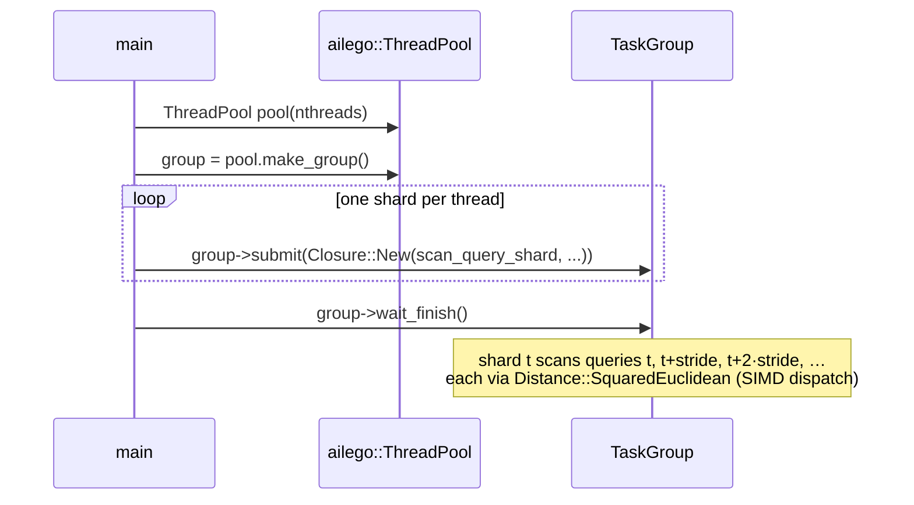
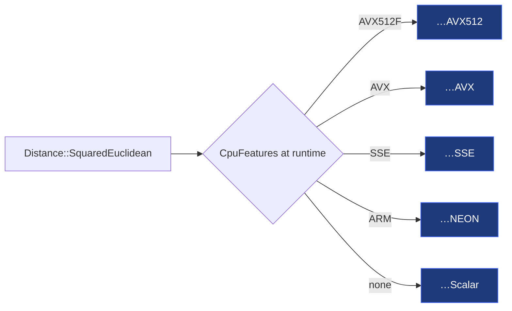
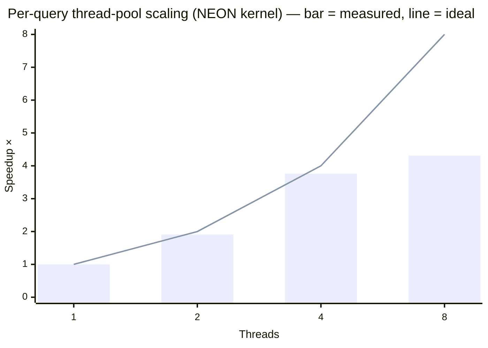

# Benchmarks

Opt-in micro-benchmarks that exercise zvec's own primitives. Configure with:

```bash
cmake -S . -B build -DBUILD_BENCHMARKS=ON -DCMAKE_BUILD_TYPE=Release
cmake --build build --target distance_scan_bench
./build/bin/distance_scan_bench [num_db] [num_query] [dim]   # default 4096 256 128
```

Each benchmark links `zvec_ailego` and self-validates, so it is also registered
as a `ctest` (run `ctest -R distance_scan_bench`).

---

## `distance_scan_bench` — per-query parallel flat scan

Measures the throughput of scanning many query vectors against a database, **the
way zvec actually scales it**: parallelism is applied *per query* across
`ailego::ThreadPool`, and each individual query is a serial scan that calls
zvec's **SIMD-dispatched** distance kernel.

This is deliberately aligned with zvec's architecture rather than cutting across
it. zvec keeps `ENABLE_OPENMP` **off** (no `#pragma omp` anywhere in `src/`),
hand-vectorizes the hot distance kernels with runtime CPU dispatch, and gets
throughput by distributing **queries** over its thread pool — the single-query
scan stays serial by design. This benchmark uses exactly those two primitives,
nothing else: no OpenMP, no hand-written intrinsics.

### The two orthogonal axes



The thread pool parallelizes the **outer** axis (queries); the SIMD kernel
vectorizes the **inner** axis (the dimension reduction of one pair). They
compose, and neither touches the other's loop — so the parallel result is
**bit-identical** to the serial one: each query writes a disjoint output row and
the per-pair reduction order is unchanged.

### Why per-query and not inside the reduction



### How parallelism is expressed (zvec primitives, not OpenMP)



### Runtime SIMD dispatch (no manual intrinsics)



The benchmark prints which path was selected
(`CpuFeatures::Intrinsics()`), so the measured numbers are tied to a concrete
ISA.

### Results

`num_db=8192, num_query=256, dim=128`, Apple Silicon (10 cores), kernel SIMD
path **NEON**, `-O3`, best-of-5. Serial baseline `0.023 s`:

| Threads | Speedup | max_abs_diff vs serial |
|--------:|--------:|-----------------------:|
| 1 | 1.00× | 0.000e+00 |
| 2 | 1.91× | 0.000e+00 |
| 4 | 3.76× | 0.000e+00 |
| 8 | 4.31× | 0.000e+00 |



Scaling is near-linear to the physical-core count, then flattens as the scan
becomes memory-bandwidth-bound (and the host's efficiency cores contribute less
than its performance cores). `max_abs_diff` is exactly `0` at every thread
count — same kernel, same order, disjoint outputs.

### Test data

Inputs are **synthetic and deterministic** (no RNG): a fixed modular pattern
(`db[i] = ((i·7+13) % 97)/97`, `query[i] = ((i·11+5) % 89)/89`). The kernel is a
dense, branch-free reduction, so timing depends on shape and access pattern, not
on the values; correctness is established by bit-for-bit comparison against the
serial reference on identical inputs, not by a data cohort. Numerical
accuracy/recall of the **quantized** kernels (int8/int4/fp16) vs fp32 is
distribution-sensitive and out of scope here.

### Provenance

The "parallelize queries, never the reduction" schedule was derived and proven
legal (no carried dependence, verified before the bit-equivalence check) with a
polyhedral auto-scheduling pass —
[cluster_compilot](https://github.com/cluster2600/cluster_compilot), an
implementation of *Agentic Auto-Scheduling* (arXiv:2511.00592). The benchmark
implements that schedule with zvec's existing `ThreadPool` + SIMD-dispatched
kernels; it proposes no kernel change.
