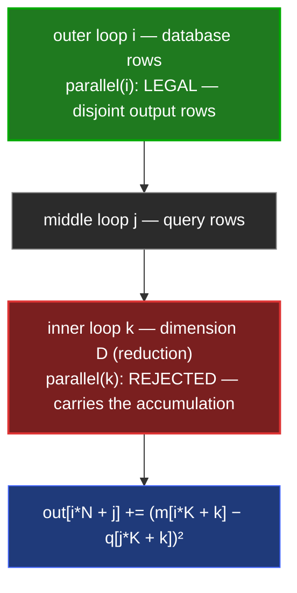
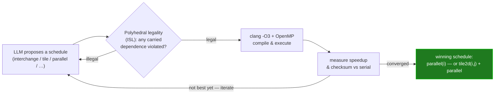
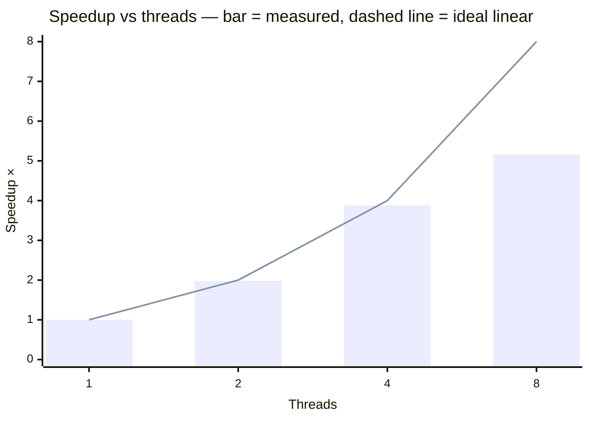

# Distance-matrix OpenMP benchmark

Measures **thread-parallelizing the outer (database-row) loop** of zvec's
squared-Euclidean distance matrix against the serial baseline.

For `M` database vectors and `N` query vectors of dimension `D`, the
distance-matrix path
(`src/ailego/math/euclidean_distance_matrix*.cc`) computes:

```
out[i][j] = sum_k (m[i][k] - q[j][k])^2
```

zvec already SIMD-vectorizes the **inner** per-pair reduction over `D`
(SSE/AVX/AVX512). This benchmark targets the **orthogonal** axis: the outer loop
over database rows `i`. Each row writes a disjoint slice of `out`, and the
reduction order within a pair is unchanged, so distributing rows across threads
is legal and the result is **bit-identical** to the serial computation.



OpenMP parallelizes **only** the green `i` loop; the red `k` reduction stays
serial within each pair, which is exactly why the output is bit-identical.

## Why this is safe (and the reduction loop is not)

The schedule — *parallelize the row loop, never the reduction dimension* — was
derived and proven legal with the polyhedral legality engine in
[**cluster_compilot**](https://github.com/cluster2600/cluster_compilot), a
from-scratch implementation of *Agentic Auto-Scheduling* (arXiv:2511.00592).
Modeling this kernel there:

- `parallel(i)` (database rows) → **legal** — no dependence is carried on `i`.
- `parallel(k)` (the `D` reduction) → **rejected** — `k` carries the
  accumulation dependence.

The benchmark encodes exactly that: OpenMP on the `i` loop only, and a runtime
correctness gate (it exits non-zero if the parallel result diverges from the
serial one, so it doubles as a test).

The schedule wasn't hand-guessed — it's what the agentic loop converges to:



Legality is *proven* before any code runs, and every accepted schedule is
checksum-verified against the serial reference — a wrong transform can neither
be proposed past the legality gate nor survive the checksum.

## Build & run

Self-contained — needs only a C++17 compiler and OpenMP, **not** a libzvec build:

```bash
# one-liner
clang++ -O3 -std=c++17 -fopenmp distance_matrix_bench.cc -o bench && ./bench

# or via CMake (adds a ctest correctness test)
cmake -S . -B build -DCMAKE_BUILD_TYPE=Release && cmake --build build
ctest --test-dir build --output-on-failure
./build/distance_matrix_bench [M] [N] [dim]     # default 1024 1024 128
```

## Results

`M=N=1024, dim=128`, Apple Silicon (10 cores), Apache `clang++ -O3`:

| Threads | Speedup |
|--------:|--------:|
| 1 | 1.00× |
| 2 | 1.98× |
| 4 | 3.88× |
| 8 | 5.16× |



`max_abs_diff` (parallel vs serial) = **0.000e+00** at every thread count —
the parallel result is bit-identical.

Scaling is near-linear until it saturates around the physical core count
(this kernel becomes memory-bandwidth-bound once enough threads stream the
input vectors). The win is independent of, and composes with, the existing SIMD
per-pair kernels.

## Notes

- The benchmark reproduces zvec's scalar kernel
  (`ailego::SquaredEuclideanDistanceScalar`) to stay self-contained. Wiring the
  same outer-loop OpenMP schedule into the SIMD-dispatched matrix kernels and
  linking against a built `libzvec` is a natural follow-up.
- Inputs are deterministic (no RNG seed), so results are reproducible.

## Test data

Inputs are **synthetic and deterministic** — a single fixed pattern generated
by a modular formula (`db[i] = ((i*7+13) % 97)/97`, `query[i] = ((i*11+5) % 89)/89`),
not random vectors and not a multi-distribution cohort. This is deliberate and
sufficient for what the benchmark claims:

- **Speedup is data-independent.** The kernel is a dense, branch-free reduction
  over `D`; it executes the same FLOPs regardless of the values, so tile/parallel
  speedup depends on array shape and access pattern, not on the numbers. Random
  inputs give the same numbers within noise.
- **Correctness is proven by cross-reference, not by a data cohort.** The parallel
  output is compared bit-for-bit against the serial reference on identical inputs
  (`max_abs_diff == 0`); ISL also proves legality before execution. Any single
  input exercising every cell suffices for an exact-equality gate.

What this does **not** measure: numerical accuracy / recall of the quantized
kernels (int8/int4/fp16) versus fp32 — that *is* distribution-sensitive and would
need realistic or randomized vectors. It is out of scope here; this benchmark is
about schedule performance and transform legality, not quantization recall.
